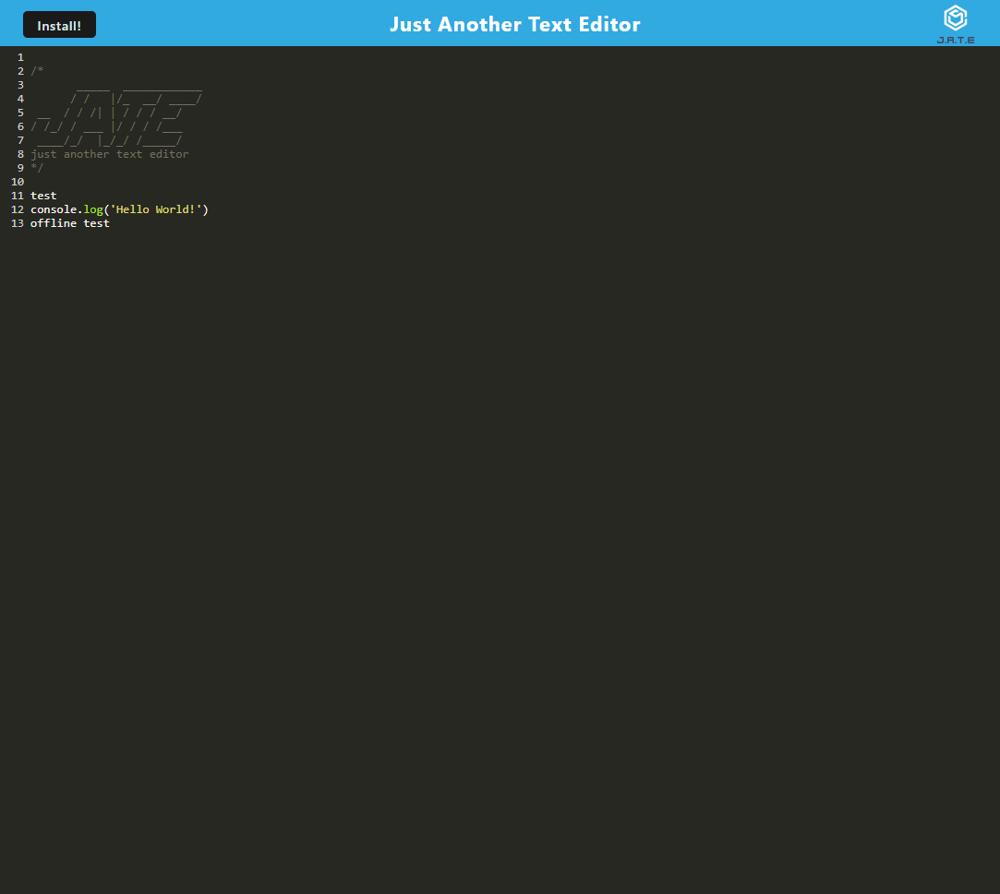

# PWA Text Editor

## Table of Contents
1. [Description](#description)
2. [Usage](#usage)
3. [Visuals](#visuals)
4. [Resources](#resources)

## Description

A text editor PWA bundled with webpack. Features include:

- A generated service worker, HTML file, and manifest
- IndexedDB for database storage
- Ability to install to desktop
- Cached assets
- Offline functionality

## Usage

When loading the page, the user can click on a line to add text. Text is saved to the IndexedDB storage. If offline, user can continue to utilize the app as normal. If desired, user can install to desktop by clicking the install button.

## Visuals
An example of the running editor

## Resources
- [Heroku Site](https://blooming-shelf-15321.herokuapp.com/)
- [Repository](https://github.com/kleylakb89/19-pwa-text-editor)